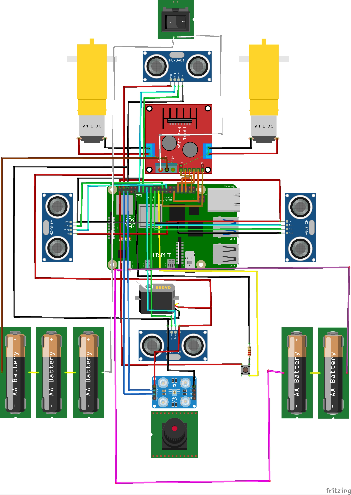

In this file we will explain how to build our car step by step.  
In case you have any doubts or found any problem please contact us.

## 1. Components
   
  - [Raspberry Pi 5](https://www.amazon.es/Raspberry-Pi-SC1111-5-4Gb/dp/B0CK3L9WD3/ref=sr_1_7?__mk_es_ES=ÅMÅŽÕÑ&crid=2MPYMY5G3LAE7&dib=eyJ2IjoiMSJ9.ptP7J3FZcmbYoZvFxUp_Vsja9oTthOJvFk_ZWVEluAxDoSrTsiAdt5n3WPTD9fT8cY0h5i0_c7LDcDXdp0E1YeZyW4mqgfmZW1w09J25DcQvUQm9wkixBmjY2gHlyesVWaoSZgaVbLWazSwXZf1neBDgVBlb9TJFuv4ffiBfdUE5E-bohxi0q6YGOpjgw0UVKe0lrri8uI9IGPPqAq7Ul5eNwrablxAAG86iJ1JaUjb0fJ5I0MWhMramdwbVES3Jr4L7ddjB_3N8PEEFgqSe3NbF85i4WqS85VB7S00VMp4.iTX148bVjpKwjM_00DvIvv83brDRXrSdKt48MHF_mok&dib_tag=se&keywords=raspberry+pi+5&qid=1723972888&sprefix=raspberry+pi+5%2Caps%2C181&sr=8-7)
  -  [L298N](https://www.amazon.es/HiLetgo®-Bridge-Stepper-Controller-Arduino/dp/B07CHBRF4Z/ref=sr_1_6?__mk_es_ES=ÅMÅŽÕÑ&crid=3CJEWNNVPNLVR&dib=eyJ2IjoiMSJ9.J1IoI4lcmBqTeHP6767NOPyHf44YnyBlMhRhNQmwhLPTvn-dkeFWVvZ24iSLNdLEsOo4ooBlprGz448954UpMxjdS0bdiWc1hwVDBXMP-t9t4_4KgoZEEybMySz0g1oxw-xZU3EWznA39EtTB1fHM7-nmBE-2RSX3PxZOuCamckWiUSHLKjgWUtkx_Y0LoXIWijt19YuN4BcRkwKV_2o7n2GrYa19QQ4jJWNpDryZuy2crPCVqmgHsKvyNFtU_g5ow7OvmKWSF_494XvJaVbwU5s7gRYqkgwMPjXoGPJd48.9j7OLBLKW3YQo2MtQQEm8taLG9BbZ2LkyE7f1IlGtZ0&dib_tag=se&keywords=l298n&qid=1723974557&sprefix=l298n%2Caps%2C188&sr=8-6)
  -  [DC Motors](https://www.amazon.es/dp/B0B3D789V3/ref=sspa_dk_detail_0?pd_rd_i=B08D39MFN1&pd_rd_w=FfHgH&content-id=amzn1.sym.16e80c5a-02ca-4e26-b568-17a6666ff4f0&pf_rd_p=16e80c5a-02ca-4e26-b568-17a6666ff4f0&pf_rd_r=0FGVWEZ861DAZHE7YZPK&pd_rd_wg=44LrF&pd_rd_r=eef15e0e-a984-43d4-a3cd-73a92bc02780&s=tools&sp_csd=d2lkZ2V0TmFtZT1zcF9kZXRhaWwy&th=1)
  -   [Micro Servo SG90](https://www.amazon.es/dp/B07CYZSVKW/ref=sspa_dk_detail_2?psc=1&pd_rd_i=B07CYZSVKW&pd_rd_w=WWqBa&content-id=amzn1.sym.d9fd07ad-95b5-4079-8602-de55e6918bc7&pf_rd_p=d9fd07ad-95b5-4079-8602-de55e6918bc7&pf_rd_r=984A9FGCQ5N7DK3AS17E&pd_rd_wg=PIPCM&pd_rd_r=a6b152ef-028d-4194-b5c9-a6f9d16d3a9f&s=toys&sp_csd=d2lkZ2V0TmFtZT1zcF9kZXRhaWw)
  -   [18650 Battery](https://es.aliexpress.com/item/1005007228231597.html?spm=a2g0o.detail.pcDetailTopMoreOtherSeller.1.2b02qaSWqaSWev&gps-id=pcDetailTopMoreOtherSeller&scm=1007.40000.327270.0&scm_id=1007.40000.327270.0&scm-url=1007.40000.327270.0&pvid=d4def50f-37a6-4321-8474-3b1b2da490f3&_t=gps-id:pcDetailTopMoreOtherSeller,scm-url:1007.40000.327270.0,pvid:d4def50f-37a6-4321-8474-3b1b2da490f3,tpp_buckets:668%232846%238109%231935&pdp_npi=4%40dis%21EUR%2112.57%211.25%21%21%2196.80%219.68%21%40211b619a17239759870871818e9591%2112000039883706387%21rec%21ES%212755819411%21X&utparam-url=scene%3ApcDetailTopMoreOtherSeller%7Cquery_from%3A)
  -   [18650 Shield](https://es.aliexpress.com/item/1005005986332436.html?spm=a2g0o.detail.pcDetailTopMoreOtherSeller.2.c15cts08ts08b4&gps-id=pcDetailTopMoreOtherSeller&scm=1007.40000.327270.0&scm_id=1007.40000.327270.0&scm-url=1007.40000.327270.0&pvid=a7e2a1ef-289c-4358-9af2-3f99fd0d2d7a&_t=gps-id:pcDetailTopMoreOtherSeller,scm-url:1007.40000.327270.0,pvid:a7e2a1ef-289c-4358-9af2-3f99fd0d2d7a,tpp_buckets:668%232846%238110%231995&pdp_npi=4%40dis%21EUR%216.19%212.01%21%21%2147.54%2115.43%21%402103835c17163972291436621eb662%2112000035190946401%21rec%21ES%213002009838%21&utparam-url=scene%3ApcDetailTopMoreOtherSeller%7Cquery_from%3A)
  -   [Dupond Cables](https://www.amazon.es/sspa/click?ie=UTF8&spc=MTozNjkwMzUwNDA3Mjc5NDg0OjE3MjM5NzY2NTQ6c3BfYXRmOjMwMDA3NjA2MDc5MjIzMjo6MDo6&url=%2FMacho-Hembra-Macho-Macho-Hembra-Hembra-Prototipo-Protoboard%2Fdp%2FB01NGTXASZ%2Fref%3Dsr_1_2_sspa%3F__mk_es_ES%3D%25C3%2585M%25C3%2585%25C5%25BD%25C3%2595%25C3%2591%26crid%3D2TG3SUQW03GAL%26dib%3DeyJ2IjoiMSJ9.B-KYcO_w3qTkIu0cpzW_-BhZJXU0NTYM3id7jUtz7j7iQhWrQ3C1sHWGmUGu85zELH1M536xvFURsBNH5qSr5fZhqsfir2jKgWLfqQLPjgx2GGN4DQp63A3E9FZoW9t92dgTJieGNUvRMMiJDuAp4QisiLRFAJe3Nii8gmbNdvChw2XplW0jGsdoa-_31Dt5dDRA412GMgu0LqCnkbR99jg8lK-4ABmIurLSZ-2RAWs.PJfocp9iiEtFUJJpKa2gan0S8B4vOrYs4Ns_Fp-JZKs%26dib_tag%3Dse%26keywords%3Ddupont%26qid%3D1723976654%26s%3Dtools%26sprefix%3Ddupon%252Cdiy%252C181%26sr%3D1-2-spons%26sp_csd%3Dd2lkZ2V0TmFtZT1zcF9hdGY%26psc%3D1)
  -   [HC-SR04](https://www.amazon.es/sspa/click?ie=UTF8&spc=MTo2Mzc3NDc2MzU1MDAxMDAxOjE3MjM5NzcyMzA6c3BfYXRmOjIwMDUxODUwMTE1NDk4OjowOjo&url=%2FAZDelivery-Distancia-Ultras%25C3%25B3nico-Raspberry-incluido%2Fdp%2FB07TKVPPHF%2Fref%3Dsr_1_1_sspa%3Fdib%3DeyJ2IjoiMSJ9.diZ4Vfd24b4Mrhkgp0sOd4DTism6LlXDXMPyfrdNSYoBy-jQbE-avTFLDoK6PDDk-94zo2u1bWKvMjuAasWsKE66HfY92lPpsI10LsGJPz0yup8jOCSMcCNbIpL2IB5wHNLSNRaj8Lauw9RmzM5Diw14nffpN3YZHIyssfvy4Ziq9K7EuAYhyxzFENO52x29dKyQdqzLztafoyphO4leDNdRZGQ4HFJXFQrbgU6rTpJ8Ovjglaz_nFN4fikN1LLAGk-SlnhVESX5PewOuOtSkpwL0I3URCNK4L5G7NkWKYI.alFO0t23z_leXnNcGoTDRkFZMGHO-xPwZAV-MSo0cmY%26dib_tag%3Dse%26keywords%3DHC-SR04%26qid%3D1723977230%26sr%3D8-1-spons%26sp_csd%3Dd2lkZ2V0TmFtZT1zcF9hdGY%26psc%3D1)
  -   [Pi Camera](https://www.amazon.es/sspa/click?ie=UTF8&spc=MTo1Nzc3MTcyNjUyNTM2NTQzOjE3MjM5NzcyODc6c3BfYXRmOjMwMDA5NzA3NTA5OTkzMjo6MDo6&url=%2FAZDelivery-c%25C3%25A1mara-para-Raspberry-Pi%2Fdp%2FB01M6UCEM5%2Fref%3Dsr_1_1_sspa%3F__mk_es_ES%3D%25C3%2585M%25C3%2585%25C5%25BD%25C3%2595%25C3%2591%26crid%3D1EUMEJ19SW47P%26dib%3DeyJ2IjoiMSJ9.KtSqKQ6nFdfceDLxjZOnfLjNr8JdArhvyeLPzOSBhSPQhmWVr9akLcwwMO7OiW615f1MC7rXTbdvuDdwIYsFt4q4QwefMRGi4XlB5z7Pox_-LO0nx93-m8BCGYWAmR6tWYzWidyS3U3FMkNmkFGQfq1p6rHFJXEo1UPpfFveACg6j5BX2P4f4e0e5zX3yqDOYJP-eBX9RwN6niw-o43p5HfwBM752NnfNy-ZXsp46Gamv9a7yMpSUJS8HebuWwwu9TvC9-DdzqrbzeFEQImYRhGps9xbDv6ykqCjJrHtwPk.Nf1ZPnFfSXzW_34mFGWBDTDya4EUhxxgsIuZ5haDQO4%26dib_tag%3Dse%26keywords%3Dpi%2Bcamera%26qid%3D1723977286%26sprefix%3Dpi%2Bcamera%252Caps%252C153%26sr%3D8-1-spons%26sp_csd%3Dd2lkZ2V0TmFtZT1zcF9hdGY%26psc%3D1%26smid%3DA1X7QLRQH87QA3)

## 2. Scheme

## 3. 3D Models

You will need to 3D print the models in the repository 'Models/Current_Car_Models'.  
In our case we have used an Ender 3, an Artillery Sidewinder X4 Pro and a Prusa Mk3s for printing the chassis out. But you can use any printer of your preference.
These parts don't need to support any abnormal forces therefore can be printed in any material. In our case we printed them with PLA.  

## 4. Chassis assemble

Once we have all the parts printed it's time to put them together. Now we will show you how to.

### 1. Base
 
 

 First of all we place the raspberry and L298N on the base at their places:  
- The Raspberry is placed transversaly in the middle of the car.  
- The L298N is placed at the back of the car in between the motors.

### 2. Stub axles

Now we place the stub axels, this will serve to transfer the rotation of the servo to the wheels to vary their direction.  
- We insert a M3 nut in each stub axel for later on
- We place the part in the hollow rods that stick out of the chassis upwards, as shown in the picture.
- We fix it in place with a M3 x 20 screw and washer, and screw it to a M3 nut at the botton of the car.

> Be careful with the hollow rod is etremly fragile.  
> Don not apply any unnecessary forces on it until it is screwed.  

### 3. Zipper

Next is the install of the zipper this will syncronize the direction of bowth sides and transfer the servo direction.  
- We place the zipper as shown in the picture above and screw it with a M3 screw and nut in each side.

### 4. Wheels and DC motors

Now we mount the four wheels to the chassis
- The two frontal ones are drilled trough the middle and fixed in placed with a M3 screw.
- We fix the two DC motors in place using glue.
- The two in the back are simply snapped in place.  

### 5. Gear and servo

To finish the direction we place the gear and the servo which will guide all the direction system.  
- We insert the gear in the servo and screw it in place
- We place the servo in it's place with the gear on top of the zipper. And fix it in place with glue.  

### 6. Battery sield and spacers

Finally we install the battery in place to power everything up.
- We glue the four spacers in place being careful to aling the holes as much as posible.
- We screw the battery shield trouhg the spacers and the usb looking to the front of the car.  

## 5. Software installation

Now that we have all the hardware redy to go, we need a "brain" to move it.  
So here we will guide you command by command how to setup your raspberry pi in order to work correctly with the hardware.

### 1. OS installation

1. Install [Raspberry Pi Imager](https://www.raspberrypi.com/software/) on your computer.

2. Download the [Raspberry Pi OS Lite](https://www.raspberrypi.com/software/operating-systems/)

3. Open Imager

4. Select your model of Raspberry. In our case it's Raspberry Pi 4

5. Select the OS image we downloaded before.

6. Select the SD card in wich we are going to intall the OS.

7. Click the "Next" buttom. And click in "Edit Settings".

8. Configure username, password and WIFI. And click on "Save".

9. Click on "Yes".

> Be carefull this proccess will erase all the information saved on the SD card.

10. Insert the SD card in to the Raspberry and power it up.

### 2. Auto-login configuration
